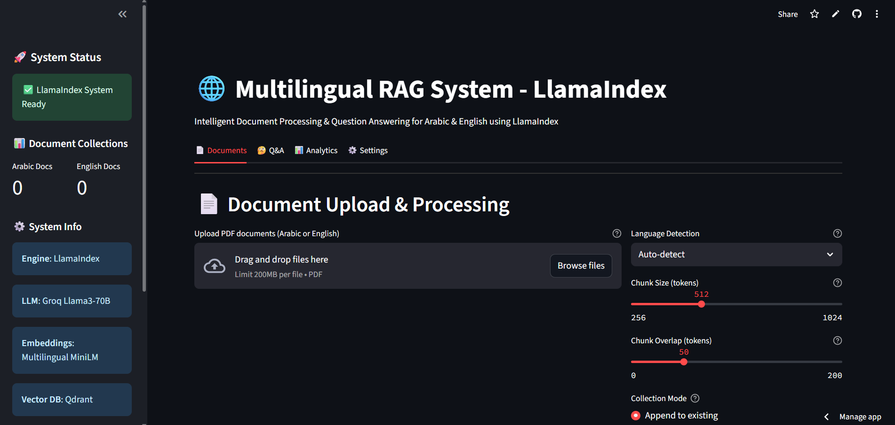
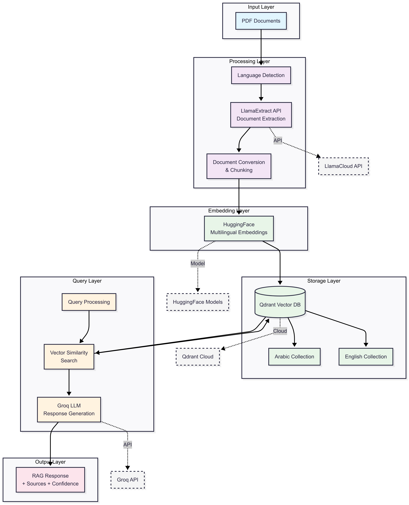

Voici la version corrigée uniquement au niveau du format et des fautes (orthographe, noms de fichiers), sans modification du contenu ou style :

````markdown
# Multilingual RAG

A **multilingual Retrieval-Augmented Generation (RAG)** system for **Arabic and English**, using **Qdrant** as the vector database, **Groq LLMs** for reasoning, and **LlamaCloud** for PDF extraction.

Supports **Streamlit** deployment for an interactive web interface.

## 🎥 Demo Video

[](https://www.youtube.com/watch?v=UE_m3gu2TEE)

---

## 🏗 Architecture Overview

The **Multilingual RAG System** is designed for **Arabic and English document understanding**.  
It separates **document processing, storage, and querying** into clear layers to ensure **scalability, multilingual support, and high-speed retrieval**.



### **1. Document Ingestion & Extraction**

* Converts raw PDFs/DOCs into structured text blocks with metadata.  
* Supports **complex layouts** (tables, multi-column text, footnotes).  
* Automatically detects **Arabic (RTL)** vs. **English (LTR)** content.  
* Outputs **clean, chunked text** ready for embedding.

### **2. Embedding & Vector Storage**

* Converts text chunks into **multilingual semantic embeddings**.  
* Stores vectors in **Qdrant Cloud** with:

  * **Language-specific collections** (Arabic / English)  
  * **High-speed vector similarity search**  
  * **Cloud scalability for large datasets**

### **3. Query Processing & Retrieval**

* Detects query language automatically.  
* Retrieves **top semantic matches** from the relevant collection.  
* Aggregates context for accurate, language-specific responses.

### **4. RAG Generation Layer**

* Powered by **Groq-accelerated Llama models**.  
* Produces **multilingual answers** enriched with:

  * **Contextual reasoning**  
  * **Source citations** (page numbers & document names)

### **5. User Interface & Deployment**

* **Streamlit web app** for interactive queries and document uploads.  
* **RTL support** for Arabic UI.  
* **Streamlit Cloud deployment** with secure secrets management.

---

## 🚀 Quick Start

### 1. Prerequisites

* Python **3.8+**  
* A free **Qdrant Cloud** account  
* API keys for:

  * **Groq** (LLM)  
  * **Qdrant** (vector DB)  
  * **LlamaCloud** (PDF extraction)

---

### 2. Installation

```bash
# Clone or download the project
git clone https://github.com/yusufM03/multilingual-rag.git
cd multilingual-rag

# Create a new conda environment
conda create -n rag-agent python=3.10 -y

# Activate environment
conda activate rag-agent

# Install dependencies
pip install -r requirements.txt
````

---

### 3. Environment Configuration

Create a `.streamlit/secrets.toml` file in the **project root**:

```toml
# Qdrant Cloud Configuration
qdrant_url=https://your-cluster-url.qdrant.tech:6333
qdrant_api_key=your-qdrant-api-key

# Groq API Keys (for LLM)
groq_api_key=gsk_your-groq-api-key-for-arabic
groq_api_key_1=gsk_your-groq-api-key-for-english

# LlamaCloud API Key (for PDF extraction)
llama_cloud_api_key=llx_your-llamacloud-api-key
```

---

### 4. Required API Keys

#### **Qdrant Cloud (Vector Database)**

1. Go to [Qdrant Cloud](https://cloud.qdrant.io/)
2. Create a free account
3. Create a new cluster
4. Copy your **cluster URL** and **API key**

#### **Groq (LLM Provider)**

1. Visit [Groq Console](https://console.groq.com/)
2. Sign up and create API keys
3. We use **two keys** for load balancing (Arabic/English)

#### **LlamaCloud (PDF Extraction)**

1. Go to [LlamaCloud](https://llamaindex.ai/)
2. Sign up and get your **API key**
3. Required for **document parsing**

---

### 5. Project Structure

```
yusufm03-multilingual-rag/
├── requirements.txt
├── docs/
│   └── architecture_overview.png   # Architecture diagram
├── research/
│   ├── ChromDb_local/
│   │   ├── instructions.md
│   │   └── localApp.py
│   └── Test_Arabic/
│       ├── arabic_llama.txt
│       ├── arabic_page_OCR.txt
│       ├── arabic_page_pymupdf.txt
│       ├── chunk.py
│       ├── Extract_tool_OCR.py
│       ├── Extract_tool_pymupdf.py
│       └── extract_tool_paddleocr.py
└── src/
    ├── app.py        # Streamlit app entry point
    └── rag_sys.py    # Core RAG system
```

---

### 6. Run the App

```bash
streamlit run src/app.py
```

Then open the local URL shown in the terminal.

---

### 7. Deployment on Streamlit Cloud

1. Push your code to GitHub
2. Deploy via [Streamlit Cloud](https://share.streamlit.io/)
3. Set your **Secrets** in `Settings → Secrets` in TOML format:

```toml
GROQ_API_KEY = "gsk_xxxx"
GROQ_API_KEY_1 = "gsk_xxxx"
QDRANT_URL = "https://xxxx.qdrant.tech:6333"
QDRANT_API_KEY = "eyJhbGciOiJIUzI1NiIsInR5cCI6IkpXVCJ9..."
LLAMA_CLOUD_API_KEY = "llx_xxxx"
```

### 8. LLMOps Evaluation

To ensure high-quality multilingual responses and monitor RAG system performance in production, we integrate LLMOps evaluation using Weights & Biases (W\&B) Cloud:

* Version Control for Prompts & Models
  Every logged query includes prompt\_version and embedding\_model\_version metadata to enable full reproducibility and easy rollback.

* Retrieval Monitoring & Drift Detection
  Continuous tracking of Recall\@K and embedding similarity distributions helps detect retrieval quality degradation or embedding drift early.

* Feedback-Driven Optimization
  Human-labeled feedback is incorporated to refine prompt engineering, retrain embedding models, and tune retrieval parameters for better accuracy.

* Regression Testing & Batch Evaluation
  Maintain a curated set of historical queries and run batch tests offline to benchmark system performance and prevent regressions after updates.

```
User Query → Qdrant Retrieval → LLM Response
       ↓                   ↓
  Retrieve Top-K        Compute Evaluation
   (context)        ┌──────────────┐
        └─────────▶│ Auto Metrics │
                   │ + W&B Logging│
                   └──────────────┘
                           ↓
              Continuous Monitoring & Improvement
                           ↓
                 Batch Regression Testing
                           ↓
               Model/Prompt Updates & Deployment
```
